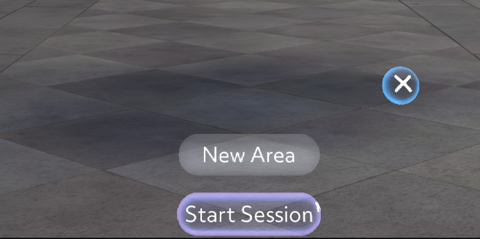
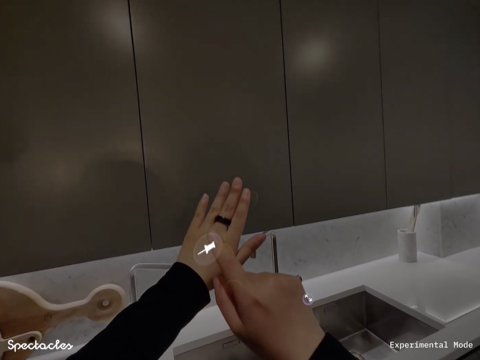
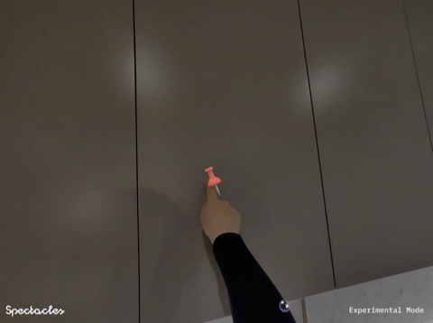
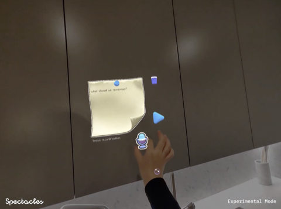
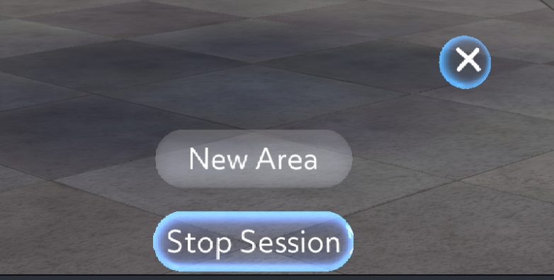
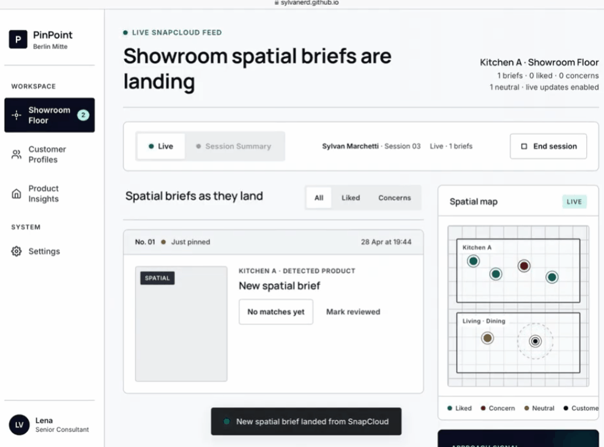

<p align="center">
  
</p>

# PinPoint

**Pin it. Say it. Sell it.**

PinPoint is a multi-platform spatial briefing system for showroom retail, built on Snap Spectacles, Snap Cloud, and a companion web portal. It captures what customers see and say, anchors those reactions to the exact products that triggered them, and delivers a structured, retrievable preference profile that turns cold introductions into informed consultations. In other words, the showroom stops being a place customers forget and starts being one that remembers them.

---

## Table of contents

- [Problem](#problem)
- [Solution](#solution)
- [Setup](#setup)
- [Features](#features)
- [User journey](#user-journey)
- [Architecture](#architecture)

---

## Problem

Showroom shoppers build strong spatial preferences, but **intent lives in space** while **conversation is verbal**—so most of what they notice never reaches the salesperson intact. Engagement mid-floor forces rediscovery from scratch; handovers and returns lose the original spatial context.

## Solution

**PinPoint:** customers wear Spectacles, pin reactions to products with voice (and crops), Snap Cloud extracts structure and catalog fit, staff see everything live on the web—turning cold “How can I help?” into consultation with context.

---

## Setup

### Prerequisites

- Lens Studio **5.15** (build **26022322**) or later
- Snap Spectacles
- Snap Spectacles developer account

### Step 1: Get the project

Unzip the project archive, then open **`PinPoint.esproj`** in Lens Studio. Allow the project to finish loading and compiling; resolve any missing-plugin prompts before deploying to hardware.

### Step 2: Set up the Remote Service Gateway API token

The Lens uses Remote Service Gateway for transcription and AI, which requires an API token.

1. In Lens Studio, open Asset Library and install the **Remote Service Gateway Token Generator** plugin (Spectacles section) if it is not already installed.
2. From the main menu, open **Windows → Remote Service Gateway Token**.
3. Click **Generate Token** for the services this Lens uses (**OpenAI** for chat completions, **Google** for Gemini object detection).
4. The generated token is wired automatically into the **`RemoteServiceGatewayCredentials`** Scene Object.

### Step 3: Pair and push to Spectacles

1. Connect Spectacles to Lens Studio via the pairing window.
2. Push the Lens with **Send to Spectacles**.
3. On device, open the Lens from the Lens carousel.

### Step 4: Open the companion web portal

Dashboard: [https://sylvanerd.github.io/PinPoint_Web/](https://sylvanerd.github.io/PinPoint_Web/)

Open it in any browser to see pins update in near real time.

### Step 5: Try the full flow

1. Put on Spectacles and open PinPoint.
2. When prompted, grant **microphone** and **camera** access (mic required for voice; camera when framing/cropping is used).
3. Select **New Area**, then **Start Session**. Start the session **before** creating pins so cloud sync attaches to an active session.

<p align="center">
  
</p>

4. The pin menu sits on the **back of your left hand**. The collapse button (top-right) hides the menu when you do not need it.

<p align="center">
  
</p>

5. Tap a pin from the menu, then touch a surface or point at something to place it.

<p align="center">
  
</p>

6. Press the microphone to record; press again to stop. Transcription can take a moment; text appears on the note shortly after you finish.

<p align="center">
  
</p>

7. Open the companion web portal — [https://sylvanerd.github.io/PinPoint_Web/](https://sylvanerd.github.io/PinPoint_Web/) (**Step 4**) — and confirm the pin with image, transcript, AI tags, and matched recommendations.
8. When finished, choose **End Session** and refresh the portal if visit summaries appear after session end.

<p align="center">
  
</p>

---

## Features

### 1. Pin & Speak & Crop (Spectacles)

Customers look at a product through Spectacles, spawn a spatial note by touching or pointing at it, and speak their reaction: "I love this handle but the color is too cold." The system bundles a quiet image capture, voice recording, real-time transcript, and world-locked anchor into one retrievable brief pinned to the exact product. Customers can also crop visual references and attach voice notes the same way.

<table>
  <tr>
    <td align="center" valign="top" width="50%">
      
    </td>
    <td align="center" valign="top" width="50%">
      
    </td>
  </tr>
</table>

### 2. AI Preference Extraction & Catalog Matching (Snap Cloud)

Each brief is processed in realtime by Snap Cloud edge functions. Voice notes are transcribed, the target product is detected via Gemini-based object detection, and intent is extracted: style, color, material, function, budget. Results are matched against the company's product catalog (temporarily using IKEA's API) to surface alternatives. The aggregated profile builds as the customer browses.

<p align="center">
  
</p>

### 3. Companion Web Portal (Salesperson Dashboard)

A live web dashboard renders each pin as a card with image thumbnail, transcript, AI tags, summary, and pre-matched product recommendations.

<table>
  <tr>
    <td align="center" valign="top" width="50%">
      
    </td>
    <td align="center" valign="top" width="50%">
      
    </td>
  </tr>
</table>

### 4. Live AR Recommendations (Two-Way Channel)

Salespeople can push product suggestions from the dashboard directly into the customer's Spectacles view in real time. The dashboard becomes a two-way channel, not a passive feed.

<table>
  <tr>
    <td align="center" valign="top" width="50%">
      
    </td>
    <td align="center" valign="top" width="50%">
      
    </td>
  </tr>
</table>

### 5. Cross-Session Memory

Profiles persist across visits and staff turnover via Snap Cloud. Returning customers' full spatial history loads instantly, and salespeople wearing Spectacles can walk the floor to see notes pinned exactly where the customer left them.

<table>
  <tr>
    <td align="center" valign="top" width="50%">
      
    </td>
    <td align="center" valign="top" width="50%">
      
    </td>
  </tr>
</table>

### 6. Session Recap & Catalog Intelligence

Every visit ends with a full recap: stats, saved images, AI summary, and one-tap email to the customer. For the business, every session feeds catalog intelligence and intent data for smarter product decisions.

---

## User journey


---

## Architecture

PinPoint is a **three-surface system** with one backend connecting two frontends:

```
┌────────────────────┐       ┌──────────────────┐       ┌────────────────────┐
│  Snap Spectacles   │◄─────►│   Snap Cloud     │◄─────►│   Web Portal       │
│  (Customer AR app) │       │   (Backend)      │       │   (Salesperson)    │
└────────────────────┘       └──────────────────┘       └────────────────────┘
   pin creation                 8 data tables              live dashboard
   voice capture                5 edge functions           realtime sync
   spatial anchors              product detection AI       recommendations
   AR recommendations           catalog matching           session recap
   crop                         realtime sync              customer profile & product insights
```

### Surface 1: Snap Spectacles AR App

Built in Lens Studio. Handles image capture via the Camera Module, voice recording and transcription via the Remote Service Gateway, and pin creation as world-anchored placements via the Spatial Anchors API. The Spectacles Interaction Kit provides hand interactors and the cursor for targeting products.

### Surface 2: Snap Cloud Backend

The intelligence layer. Designed so AR processing stays on Spectacles and everything else runs in the cloud, keeping the glasses responsive and avoiding thermal throttling.

**8 data tables**, for example:

- Sessions
- Pins
- Products
- Visit Summaries
- Recommendations

**5 edge functions** handle:

1. Product object detection (Gemini models, predefined product classes)
2. AI summary generation
3. Intent and preference extraction
4. Catalog matching
5. Spawning recommended products in AR

### Surface 3: Companion Web Portal: https://sylvanerd.github.io/PinPoint_Web/

Built in HTML, connected to Snap Cloud Realtime. Renders each spatial note as a card with image thumbnail, transcript, AI summary, intent tags, and recommended products as they arrive. Surfaces a customer profile view aggregating preferences across sessions, and a product insight view showing how items are reacted to across the catalog. Salespeople can trigger pushes back to the Spectacles view from this surface.
